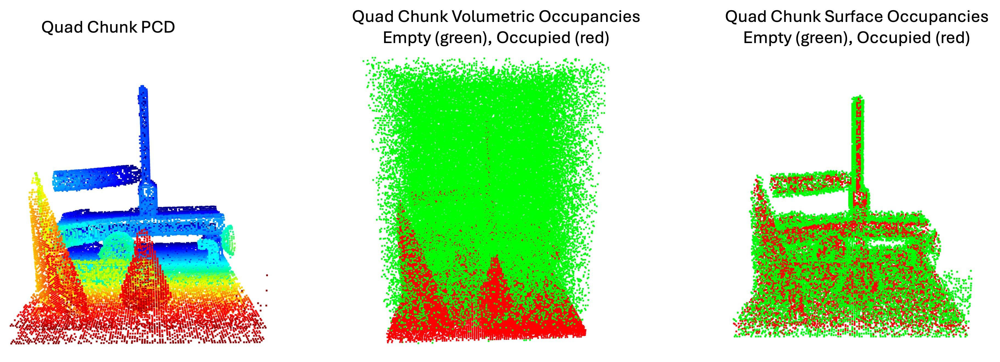

# 🪡Nui(縫い)Scene43 Dataset

## NuiScene: Exploring Efficient Generation of Unbounded Outdoor Scenes

[Han-Hung Lee](https://hanhung.github.io/), [Qinghong Han](https://sulley.cc/), [Angel X. Chang](https://angelxuanchang.github.io/)

**[Paper](https://arxiv.org/abs/2503.16375)** | **[Project Page](https://3dlg-hcvc.github.io/NuiScene/)** | **[Dataset Page](https://3dlg-hcvc.github.io/NuiScene43-Dataset/)** | **[Model Code](https://github.com/3dlg-hcvc/NuiScene)**

## Install Environment

```
# create and activate the conda environment
conda create -n sasu python=3.10
conda activate sasu

# install PyTorch
conda install pytorch==2.2.1 torchvision==0.17.1 torchaudio==2.2.1 pytorch-cuda=12.1 -c pytorch -c nvidia

# install Python libraries
pip install -r requirements.txt

# install diffusers
pip install --upgrade diffusers[torch]

# install torch-cluster
conda install pytorch-cluster -c pyg

# install positional encoding
pip install positional-encodings[pytorch]
```

## Download and Visualize Dataset

1. Download dataset
```
python utils/download_data.py
```
2. Visualize scene. Will save a ***scene_id.obj*** and ***scene_id_maps.png***. Object file saves the marching cubes of the occupancy grid of the scene and the image file shows the sample maps used to sample chunks from the scene.
```
python utils/vis_data.py --scene_id=857673bc44c8411ca8aca7cab3be7091

# Some scenes will have scene_id_0~scene_id_3. These scenes were too large for our occupancy conversion script. So we split the scene into smaller scene blocks for occupancy conversion.
python utils/vis_data.py --scene_id=5f1822bbb40c43b097c4c98ecc697ed2_0
```

**[Note]** You can find our tool for converting from mesh to occupancy [here](https://github.com/hanhung/taichi_mesh2sdf).

## Sample h5 for Training

1. Sample chunks from the scenes. In the ***metadata*** folder you can find the scene configs we used for 1_scene, 4_scene and 13_scene scenarios (which scenes are used as well as number of chunks to sample from the scenes). Note that you can run the below four python lines in 4 terminal sessions. This allows the sampling to be parallelized. The output chunks will be in ***data/test_scene_cs100***.
```
# metadata/test_scene.json samples 100 chunks from multiple scenes to test the script, run metadata/1_scene.json, 4_scene.json, 13_scene.json for paper configurations.
# --num_splits flag in the script controls how many portions to split the scenes.
# --split_idx flag controls which portion of the split to process.
# --quad_chunk_size is the quad chunk size in the paper (height and width of a 2x2 chunk).

python sample_chunks/sample_chunks.py --sample_json=metadata/test_scene.json --quad_chunk_size=100 --num_splits=4 --split_idx=0
python sample_chunks/sample_chunks.py --sample_json=metadata/test_scene.json --quad_chunk_size=100 --num_splits=4 --split_idx=1
python sample_chunks/sample_chunks.py --sample_json=metadata/test_scene.json --quad_chunk_size=100 --num_splits=4 --split_idx=2
python sample_chunks/sample_chunks.py --sample_json=metadata/test_scene.json --quad_chunk_size=100 --num_splits=4 --split_idx=3
```
2. Convert the sampled scene chunks into a h5 file. There is an additional json files produced that maps the chunks to the scenes that it was sampled from.
```
# See output message to find the h5 and json file location.
python sample_chunks/convert_h5.py --sample_json=metadata/test_scene.json --quad_chunk_size=100
```
3. Visualize sampled chunks.
```
python utils/vis_h5.py --h5_file=data/test_scene_qcs100.h5
```

4. Use sampled h5 for training. Please see the [model repo](https://github.com/3dlg-hcvc/NuiScene?tab=readme-ov-file) for more details.

## Config Format in Metadata

The json configuration files has the below format:
```
{
    "3b61335c2a004a9ea31c8dab59471222": 100000,
    "19b198bb18be49498db3b647abebc755_1": 50000,
    "19b198bb18be49498db3b647abebc755_3": 50000,
    "41697300a4c643d089784b8688b2ed2c": 50000,
    "deb4dc75e62346c19c117bf61334eeb5": 50000
}
```
Here the keys (ie. "3b61335c2a004a9ea31c8dab59471222") indicates the scene the sample from and the values (ie. 100000) indicate the number of quad chunks to sample

## Citation

```
@misc{lee2025nuisceneexploringefficientgeneration,
      title={NuiScene: Exploring Efficient Generation of Unbounded Outdoor Scenes}, 
      author={Han-Hung Lee and Qinghong Han and Angel X. Chang},
      year={2025},
      eprint={2503.16375},
      archivePrefix={arXiv},
      primaryClass={cs.CV},
      url={https://arxiv.org/abs/2503.16375}, 
}
```

## Acknowledgements

This work was funded by a CIFAR AI Chair, an NSERC Discovery grant, and a CFI/BCKDF JELF grant. We thank Jiayi Liu, and Xingguang Yan for helpful suggestions on improving the paper.
